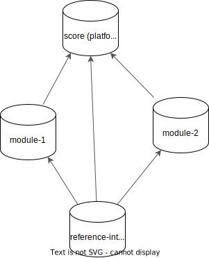
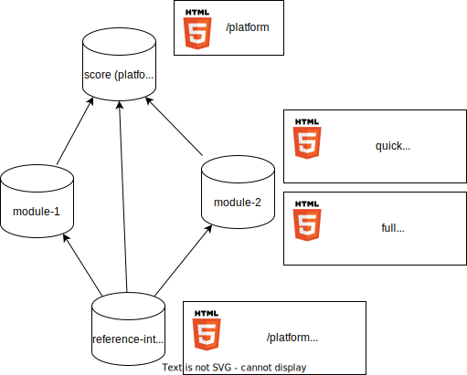

# Decision Record: multirepo setup in SCORE

## Problem Statement

Stakeholder requirements and features requirements of SCORE are in `/score`
repository (called *platform* hereafter), while their implementations and
implementation-specific-requirements will be in `/module-<xyz>` repositories.
Those modules need to link requirements they are implementing. Currently
linking is only possible within a single repository.

## Decision

**Status**: In Review

**Chosen solution**: Copying (embed rst source via bazel)

## Context: Current/planned repository dependencies in detail

The project is set up as a multi-repository project.

#### score (*platform*)
The `score` repository contains process-requirements and process-tooling
(docs-as-code) as well as feature-requirements. We'll call it the *platform*.

The *platform* is not aware of individual modules, as they are implemented in
separate repositories and potentially outside of SCORE.

#### module-\<xyz\>
Each `module-<xyz>` repository contains module-level-requirements, derived from
feature requirements. It also contains the module implementation.

As each module implements a subset of the feature requirements, it needs to
link to the feature requirements in the *platform* repository.

#### reference_integration
The `reference_integration` brings everything together. It contains a reference
to a specific version of the platform and to all required modules.

Other integrations are possible, which will contain different versions of the
platform and different modules.

## Requirements
* links must remain correct and working over time, at least for all released versions.
* in general dependencies between repositories should be possible on any
  version, not only on released versions. That's the only way to ensure quick
  iterations and feedback loops.

## Use Cases
1) Build docs for *platform*
   - Content: process requirements, feature requirements, guidance, etc
   - Traceability: no links to other repositories
2) Build docs for one module individually (quick)
   - Content: module requirements, module implementation
   - Traceability: no links to other repositories
3) Build docs for one module individually (full)
   - Content: module requirements, module implementation, feature-requirements
     coverage
   - Traceability: bidirectional links to *platform*. This implies that the
     *platform* is re-built as well, this time with links to the module.
4) Build docs for Reference integration
   - Content: platform, all modules, metrics
   - Traceability: bidirectional links between *platform* and all modules. This
     implies that all docs are re-built, this time with links to each other.

These lead to the following **independent** websites:

Some derivations of these types are possible as well, e.g. building one module
with unidirectional links to the *platform*.

## Constraints

* For the sake of this decision we'll assume all repositories follow the same process (version) with the same tooling (version). That means e.g. different set of mandatory attributes is not possible.
* usage of sphinx templates is not accounted for.
* no need to take data protection into account (everything is open source under the same license)
* no need to take performance into account (we'll assume that the performance of the chosen solution is acceptable)
* integration-specific requirements are not considered here

## Previous Decisions:

*Unfortunately those are not documented, therefore we cannot provide links to any decision records.*
* In score different repositories are handled by bazel.
* In score requirements and links are implemented via `sphinx-needs`.
* In score versioning of requirement-links is handled via hashes.
* We have two different mechanisms for versioning. Current assumption is that we'll use bazel to pull other repositories in a specific version, while we never pull different versions of the same repository. So basically, we have the "classic multi repo setup" situation.

## Alternatives

These are the identified alternatives. We'll dive into each one in detail.
1) needservice
2) weblinks
3) needimport
4) Needs-external-needs
5) Copying

### 1) needservice

This is basically a manual approach to the problem. As long as any other solution works,
that would be preferrable.

### 2) weblinks

We can simply link pages / needs in the other repositories by their full url.
While we can ensure that those links work, everything beyond that will become problematic.
Versioning might be solvable, but checking correct hashes (versioning) would be challenging.

Bidirectional links are not possible. As we'd like the same approach everywhere, this is a **no-go**.

### 3) needimport

This is a sphinx-needs extension that allows to link to needs in other repositories.
The other repositories do NOT need to be available at build time. Only their build output is required (needs.json).

needs from the other repositories are imported, as if they were local.
All structure is lost! All surrounding text, images etc are lost. Only the needs themselfes are imported. This is a **no-go**.

### 4) Needs-external-needs (+ intersphinx)

This is a sphinx-needs extension that allows to link to needs in other repositories.
The other repositories do NOT need to be available at build time. Only their build output is required (needs.json).

For bidirectional linking:
* Build all repositories once, so we have needs.json
* Exchange needs.json
* Build all repositories again

As is already evident in the requirements, we need multiple versions of the score repository website. One per integration. Since the pure score repository website shall not contain links to the other repositories, except when used in the context of an integration.

Pro:
* Bidirectional links are possible
* Good performance (no need to build all repositories at once)

Con:
* needs.json and the entire website needs to be hosted in multiple versions.
* bidirectional links affect the score-website, which is not desired (Req 2.4 + 3.5).

Within the bounds of the requirements, this is a **no-go**.

### 5) Copying

We use bazel to "import" the other repositories.
When building a module or even an integration, everything is build in one go, into one website.

Pro:
* Bidirectional links are possible
* In reference implementation the versioning is handled by bazel for source code anyway. Since docs are located next to the source code, Version handling for docs is for free!

Con:
* Relies heavily on bazel -> potential problems with esbonio etc
* **Performance / runtime** (especially with e.g. doxygen)

Approach in detail (initial idea):
* Use bazel to depend on the other repositories.
* Use links (ln) to create temporary links the other repositories inside the bazel- directories, so they appear to sphinx as if they were local files in the same repository.
