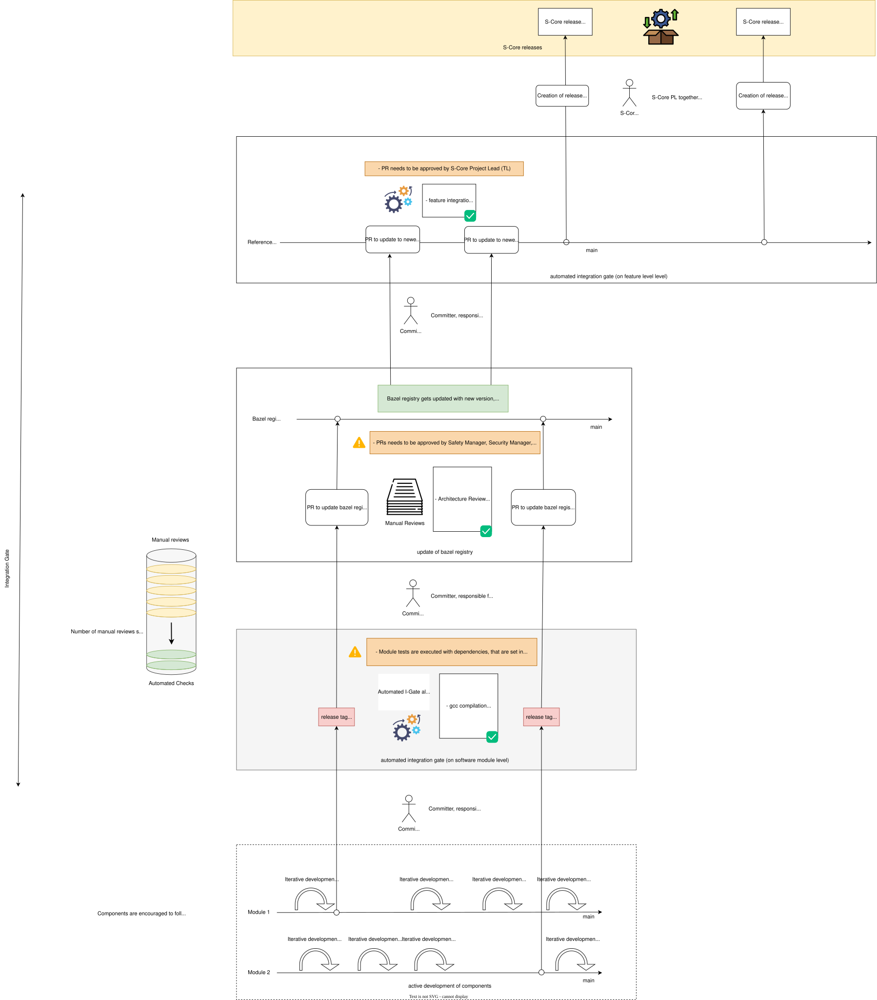

<!--
Copyright (c) 2025 Contributors to the Eclipse Foundation

See the NOTICE file(s) distributed with this work for additional
information regarding copyright ownership.

This program and the accompanying materials are made available under the
terms of the Apache License Version 2.0 which is available at
https://www.apache.org/licenses/LICENSE-2.0

SPDX-License-Identifier: Apache-2.0
-->

# DR-003-Infra: Integration Testing in a Distributed Monolith - Implementation

* **Status**: Draft. NOT DISCUSSED YET!
* **Owners**: Infrastructure Community
* **Date:** 2025-03-22

---
## Executive Summary

[DR-002](./DR-002-infra.md) discussed the challenges of integration testing in a
distributed monolith architecture.

We agreed on applying [continuous integration](https://martinfowler.com/articles/continuousIntegration.html) within S-CORE, meaning that every change to any component is verified by integration tests before being merged.

However:
1) we have external components that are not under S-CORE control and may not wish for integration feedback on every PR.
2) temporarily we have components in S-CORE that do not use PRs, upon which [DR-002](./DR-002-infra.md) relies.
3) implementation of [DR-002](./DR-002-infra.md) is not available yet, and we need
a solution for the time being.
4) interaction of integration and releases is poorly described in [DR-002](./DR-002-infra.md)?!

## Implementation Alternatives

### Let's recap workflow according to [DR-002](./DR-002-infra.md)

* Within components PRs are created.
  * component local verification is executed.
  * integration testing (quick) is executed.
* Post merge:
  * integration test (full) is executed.
* Only after successful integration testing (full) a release can be created

*Ideally this already solved point 4 :-)*

### Alternative 1

Introduction of an *integration gate*, which sits between the components and update of the bazel registry:

* Components can trigger a "release procedure" at any time
* The integration gate checks if the version qualifies for a release (compiles, tests pass etc)
* After release integration testing is executed

## Alternative 2

### Extension for issue 1

External dependencies are treated as a PR in any case. Regardless of details, somewhere the version needs to be bumped.
As with any change in S-CORE this must happen via PR.
Therefore the normal workflow applies.

### Extension for issue 2

Components that push directly to main do not benefit from a healthy mainline, nevertheless we can provide timely feedback.

* component development: changes are pushed directly to main.
* Post merge (automated):
  * component local verification is executed.
  * integration testing (quick) is executed.
  * integration testing (full) is executed.
* Only after successful integration testing (full) a release can be created

### Extension for issue 3

There is no shortcut for implementation, but there are shortcuts in functionality.

In a first step, we'll exclude:
* integration testing (full) ---> how to block/make releases???
* cross repository support --> PRs need to be merged in order / while being red.

## Analysis

Alternative 1 solves issues 1-3, but it negates the effects of continuous integration, as releases are not verified before integration.

Alternative 2 can be implemented as a stepping stone towards the final solution of [DR-002](./DR-002-infra.md).
